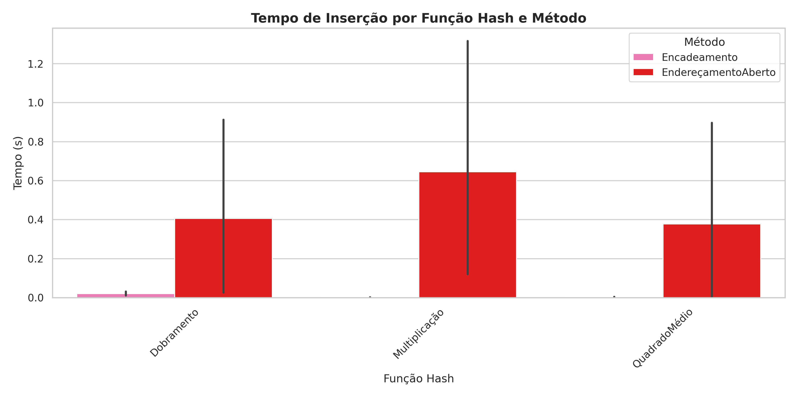
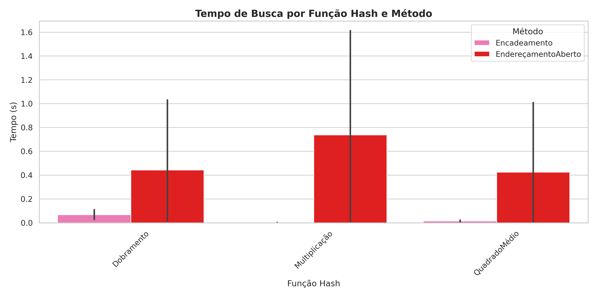
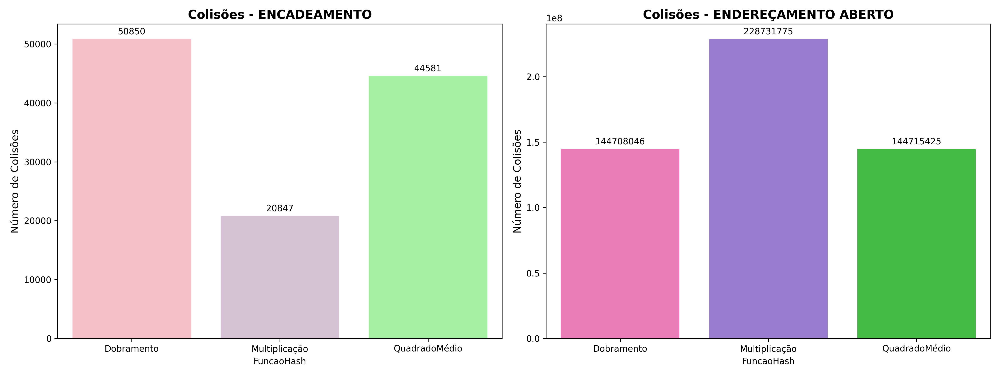
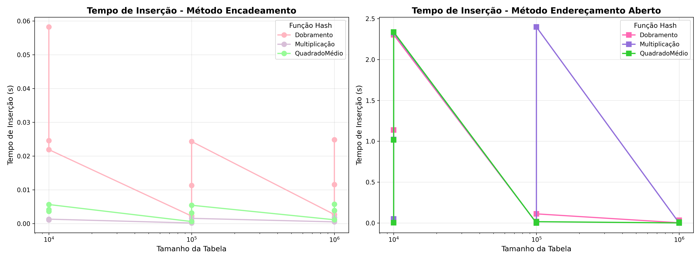
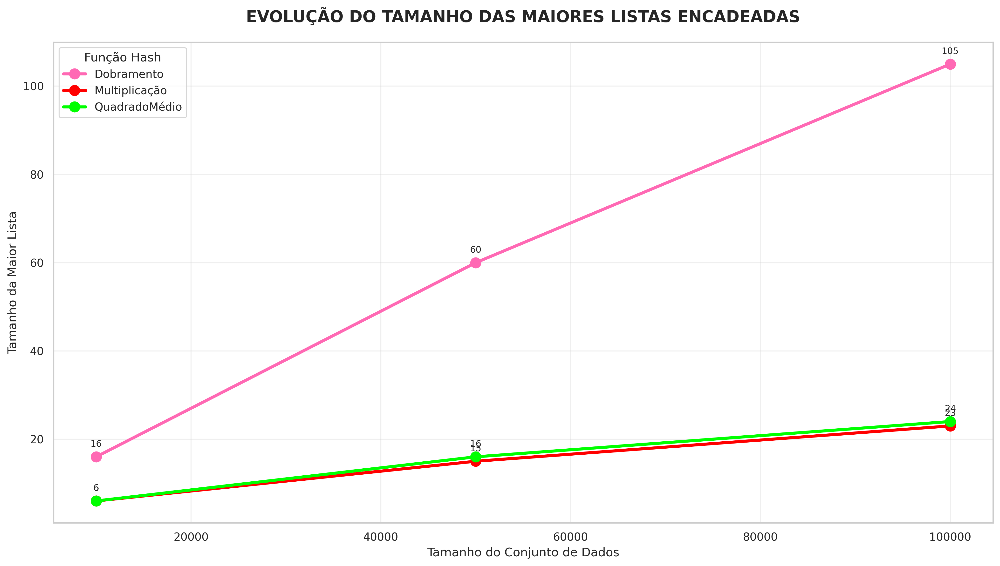
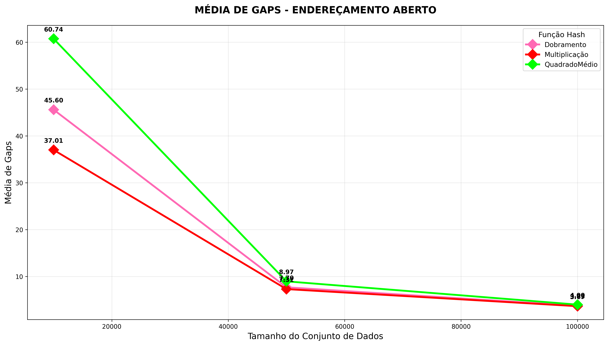
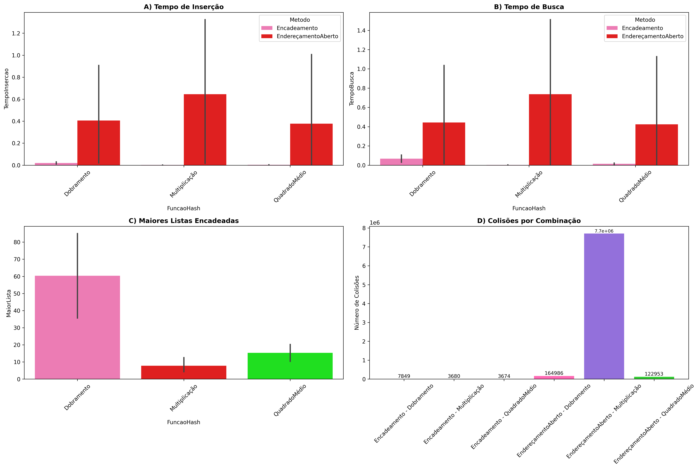

# PJBL-Hash

Disciplina: Resolução de Problemas Estruturados na Computação

Curso: Ciência da Computação

Professor: Andrey Cabral Meira

Alunos: Cecília Lucchesi Mardegan, Christine von Schmalz, Erick Maestri de Souza

# Relatório

Uma tabela hash é uma estrutura de dados que associa chaves a valores de forma eficiente.

Ela funciona como um vetor no qual o índice onde o elemento será inserido é calculado por uma função hash.	

Os tipos de tabela hash que nós utilizamos foram:

- Tabela Hash Encadeada, onde cada posição da tabela contém uma lista encadeada. Ou seja, quando ocorre uma colisão, o novo elemento é adicionado ao final da lista daquela posição.
- Tabela Hash Aberta (endereçamento aberto) na qual quando ocorre uma colisão, o algoritmo procura outra posição vazia dentro da tabela, seguindo uma regra específica.

Uma função hash transforma a chave em um índice dentro do tamanho da tabela.

Os tipos de função hash que nós utilizamos foram:

- Função de Dobramento, a qual divide a chave em partes, soma ou combina essas partes e tira o módulo pelo tamanho da tabela.
- Função da Multiplicação, que multiplica a chave por uma constante fracionária e utiliza a parte decimal do resultado.
- Função do Quadrado Médio, que eleva a chave ao quadrado e extrai os dígitos centrais do resultado e são esses dígitos que formam o índice da tabela.

Optamos por utilizar essas funções porque são computacionalmente eficientes, o modo que cada uma opera para gerar os índices é interessante, são fáceis de compreender e simples de implementar, mas também geram resultados diversos para a análise. Com isso, podemos analisar as diversas combinações diferentes entre tabelas e funções hash para descobrirmos qual é a melhor combinação dependendo do contexto que seriam aplicadas.

Os tamanhos de tabelas são de 10,000, 100,000 e 1,000,000 posições, e os conjuntos são de 10,000, 50,000, e 100,000 registros. Escolhemos dessa forma para criar contextos nos quais há combinações que tem espaços sobrando e outras que ficam cheias, e assim pode ser feita a análise dos gaps.

## Tempo de inserção por função hash e método:

Nesse gráfico há a comparação do tempo médio de inserção entre diferentes funções hash e métodos de tratamento de colisões. Pode-se analisar que o método de encadeamento é muito mais rápido para a inserção de dados do que o endereçamento aberto, porque ele não precisa procurar uma nova posição toda vez que há uma colisão - ele apenas insere o elemento no final da lista encadeada. Além disso, a função hash mais eficiente é a função do quadrado médio. Isso ocorre porque essa função tende a distribuir melhor as chaves na tabela, reduzindo a quantidade de colisões e assim, o tempo de inserção.

## Tempo de busca por função hash e método:

Aqui é mostrado o tempo necessário para buscar todos os elementos em cada configuração. Novamente, o encadeamento é mais rápido que o endereçamento aberto e a melhor combinação é o método de encadeamento junto com a função hash de multiplicação. Isso acontece pois no endereçamento aberto, as colisões formam agrupamentos, os clusters que aumentam o tempo de busca. Já no encadeamento, listas longas também podem aumentar esse tempo, mas a função hash de multiplicação consegue criar índices de maneira eficiente e gera uma boa dispersão das chaves, evitando que listas longas sejam criadas.

 
## Número de colisões por função hash e método:

Nesses gráficos há o número total de colisões ocorridas durante as inserções. Pode-se observar que há um gráfico para o método de encadeamento e outro para o método de endereçamento aberto, os dados foram separados dessa forma devido à enorme diferença na quantidade de colisões entre os métodos. O método de encadeamento teve o melhor desempenho, com a função hash de multiplicação sendo a melhor em conjunto com o encadeamento, mas a pior quando usada com o endereçamento aberto. Isso ocorre, pois, a multiplicação, apesar de gerar bons índices para o encadeamento, tende a produzir clusters quando usada com o endereçamento aberto, prejudicando a distribuição.

## Tempo de inserção:

Aqui é mostrado como o tempo de inserção varia com o tamanho da tabela hash. Pode-se observar como o método de encadeamento tem a melhor performance em geral e que junto com esse método a função hash de multiplicação é a mais eficiente, enquanto no método de endereçamento aberto, ela é a que apresenta o pior desempenho. Além disso é possível notar que os melhores tamanhos de tabela, onde ambos os métodos têm melhor desempenho, são os maiores, devido à menor ocorrência de colisões.

## Evolução do tamanho das maiores listas encadeadas:

Nesse gráfico é analisada a evolução do tamanho da maior lista encadeada conforme aumenta o conjunto de dados. É interessante notar que conforme o tamanho de conjunto de dados aumenta, as funções hash de multiplicação e de quadrado médio mantêm um ótimo desempenho, enquanto a de dobramento cresce muito mais, causando uma lista encadeada longa que irá impactar diretamente no tempo de busca e de inserção, prejudicando-os, como pode ser analisado nos gráficos de tempo de busca e de tempo de inserção, nos quais a função hash de dobramento, junto com o método de encadeamento apresenta a pior performance.

## Média de gaps no endereçamento aberto

Aqui é mostrada a média dos espaços vazios entre elementos no endereçamento aberto. Para avaliar se uma função hash tem bom desempenho nesse contexto, é necessário analisar se ela tem uma média pequena, media ou grande, pois médias pequenas indicam que os elementos estão muito agrupados, o que causa buscas mais lentas por ter que percorrer por muitos elementos e também uma inserção mais demorada devido à quantidade de colisões. Já médias muito grandes indicam um uso ineficiente de memória, então um tamanho médio para as médias dos espaços vazios seria o ideal. Nesse contexto, quando o tamanho do conjunto de dados ainda não é grande, a melhor performance pode ser atribuída à função hash de dobramento, porém conforme mais dados são inseridos, as funções mostram um desempenho semelhante, não havendo uma função que se destaque de forma clara.

## Visão geral:

Aqui podemos observar as diferenças entre os métodos e funções nas principais métricas. A partir desses gráficos e dos anteriores, é possível tirar algumas conclusões sobre os métodos e funções hash usadas:

1. O melhor método em geral é o encadeamento, pois ele mantém tempos de inserção e busca mais baixos, mesmo em conjuntos grandes.
   
2. A combinação entre encadeamento e a função de multiplicação gera os melhores resultados, enquanto endereçamento aberto e a função de multiplicação gera os piores resultados. Isso pode ser explicado através da forma como esse método lida com colisões: o algoritmo percorre os próximos índices para achar um que está vazio e fazer a inserção. Como a função de multiplicação gera valores próximos, numa tabela de endereçamento aberto isso acaba gerando clusters (agrupamentos de posições ocupadas consecutivas), o que aumenta a quantidade de colisões e reduz o desempenho.

3. Também é possível observar que a função de dobramento em geral teve um desempenho inferior às outras funções quando em conjunto com o método de encadeamento, devido à má distribuição das chaves, mas foi intermediária no endereçamento aberto.
   
4. Já a função hash de quadrado médio mostra uma performance boa e equilibrada nos dois métodos, geralmente tendo um melhor desempenho que a função de dobramento e muitas vezes sendo melhor que a multiplicação no método de endereçamento aberto, o que a torna a função mais estável e eficiente de forma geral.

   
